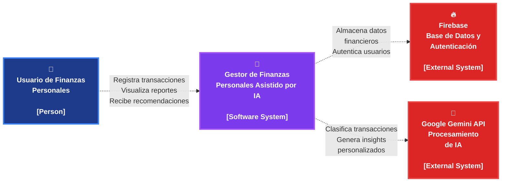

# Diagrama C1 - Contexto del Sistema

Este diagrama muestra la interacción entre el usuario y el sistema principal, así como las dependencias externas.

## Descripción

Este diagrama de contexto (C1) representa la visión de alto nivel del sistema "Gestor de Finanzas Personales Asistido por IA" y muestra:

- **Usuario de Finanzas Personales**: Persona que interactúa con la aplicación
- **Sistema Principal**: La aplicación móvil desarrollada en Flutter
- **Firebase**: Servicio externo para base de datos y autenticación
- **Google Gemini API**: Servicio externo de inteligencia artificial

## Interacciones Principales

1. **Usuario ↔ Sistema**: Registro de transacciones, visualización de reportes y recepción de recomendaciones
2. **Sistema ↔ Firebase**: Almacenamiento de datos financieros y autenticación de usuarios
3. **Sistema ↔ Gemini API**: Clasificación automática de transacciones y generación de insights personalizados
