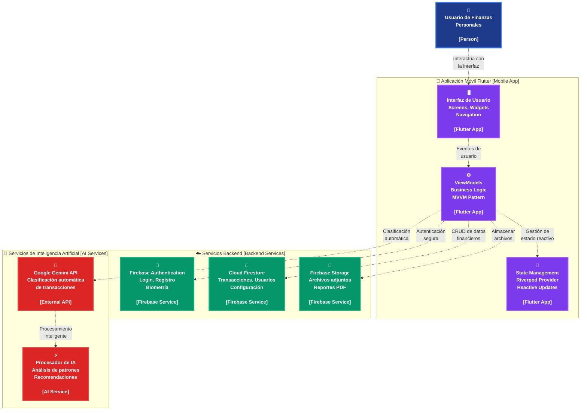

# Diagrama C2 - Contenedores

Este diagrama detalla la arquitectura interna del sistema, mostrando los principales contenedores y sus responsabilidades.

## Descripción

Este diagrama de contenedores (C2) muestra la arquitectura interna detallada del sistema, organizada en tres grupos principales:

### 📱 Aplicación Móvil Flutter
- **Interfaz de Usuario**: Screens, Widgets y Navigation
- **ViewModels**: Lógica de negocio siguiendo el patrón MVVM
- **State Management**: Gestión de estado reactivo con Riverpod

### ☁️ Servicios Backend
- **Firebase Authentication**: Login, registro y autenticación biométrica
- **Cloud Firestore**: Almacenamiento de transacciones, usuarios y configuración
- **Firebase Storage**: Gestión de archivos adjuntos y reportes PDF

### 🤖 Servicios de Inteligencia Artificial
- **Google Gemini API**: Clasificación automática de transacciones
- **Procesador de IA**: Análisis de patrones y generación de recomendaciones

## Flujo de Datos

1. **Usuario** interactúa con la **Interfaz de Usuario**
2. **UI** envía eventos al **ViewModel**
3. **ViewModel** gestiona el **Estado** y comunica con servicios externos
4. **Backend Services** manejan autenticación, datos y almacenamiento
5. **AI Services** procesan transacciones y generan insights
