# Diagrama C3 - Componentes

Este diagrama detalla los componentes principales dentro de cada contenedor del sistema, mostrando las clases, interfaces y responsabilidades específicas.

```mermaid
graph TB
    %% Usuario
    Usuario["👤<br/>Usuario de Finanzas<br/>Personales<br/><br/>[Person]"]

    %% Aplicación Móvil Flutter - Componentes
    subgraph AppMobile["📱 Aplicación Móvil Flutter [Mobile App]"]
        subgraph UI["🖥️ Interfaz de Usuario [UI Layer]"]
            LoginScreen["🔑<br/>LoginScreen<br/>Autenticación<br/><br/>[Screen]"]
            DashboardScreen["📊<br/>DashboardScreen<br/>Resumen financiero<br/><br/>[Screen]"]
            TransactionScreen["💳<br/>TransactionScreen<br/>Gestión de transacciones<br/><br/>[Screen]"]
            ReportsScreen["📈<br/>ReportsScreen<br/>Visualización de reportes<br/><br/>[Screen]"]
            Navigation["🧭<br/>Navigation<br/>Navegación entre screens<br/><br/>[Component]"]
        end

        subgraph ViewModels["⚙️ ViewModels [Business Logic Layer]"]
            AuthViewModel["🔐<br/>AuthViewModel<br/>Lógica de autenticación<br/><br/>[ViewModel]"]
            TransactionViewModel["💰<br/>TransactionViewModel<br/>Lógica de transacciones<br/><br/>[ViewModel]"]
            ReportsViewModel["📊<br/>ReportsViewModel<br/>Lógica de reportes<br/><br/>[ViewModel]"]
            AIViewModel["🤖<br/>AIViewModel<br/>Lógica de IA<br/><br/>[ViewModel]"]
        end

        subgraph State["🔄 State Management [State Layer]"]
            AuthState["🔑<br/>AuthState<br/>Estado de autenticación<br/><br/>[Provider]"]
            TransactionState["💳<br/>TransactionState<br/>Estado de transacciones<br/><br/>[Provider]"]
            UIState["🎨<br/>UIState<br/>Estado de interfaz<br/><br/>[Provider]"]
        end
    end

    %% Servicios Backend - Componentes
    subgraph Backend["☁️ Servicios Backend [Backend Services]"]
        subgraph Auth["🔐 Firebase Authentication [Auth Service]"]
            AuthService["🔐<br/>AuthService<br/>Gestión de autenticación<br/><br/>[Service]"]
            BiometricAuth["👆<br/>BiometricAuth<br/>Autenticación biométrica<br/><br/>[Component]"]
        end

        subgraph Firestore["💾 Cloud Firestore [Database Service]"]
            TransactionRepo["💰<br/>TransactionRepository<br/>CRUD transacciones<br/><br/>[Repository]"]
            UserRepo["👤<br/>UserRepository<br/>Gestión de usuarios<br/><br/>[Repository]"]
            ConfigRepo["⚙️<br/>ConfigRepository<br/>Configuración app<br/><br/>[Repository]"]
        end

        subgraph Storage["📁 Firebase Storage [Storage Service]"]
            FileService["📄<br/>FileService<br/>Gestión de archivos<br/><br/>[Service]"]
            PDFGenerator["📋<br/>PDFGenerator<br/>Generación de reportes<br/><br/>[Component]"]
        end
    end

    %% Servicios de IA - Componentes
    subgraph AI["🤖 Servicios de Inteligencia Artificial [AI Services]"]
        subgraph GeminiAPI["🧠 Google Gemini API [External API]"]
            ClassificationAPI["🏷️<br/>ClassificationAPI<br/>Clasificación de transacciones<br/><br/>[API Interface]"]
            InsightsAPI["💡<br/>InsightsAPI<br/>Generación de insights<br/><br/>[API Interface]"]
        end

        subgraph AIProcessor["⚡ Procesador de IA [AI Service]"]
            PatternAnalyzer["🔍<br/>PatternAnalyzer<br/>Análisis de patrones<br/><br/>[Component]"]
            RecommendationEngine["🎯<br/>RecommendationEngine<br/>Motor de recomendaciones<br/><br/>[Component]"]
            MLProcessor["🧮<br/>MLProcessor<br/>Procesamiento ML<br/><br/>[Component]"]
        end
    end

    %% Interacciones entre componentes
    Usuario -.->|"Interactúa"| LoginScreen
    LoginScreen -.->|"Autentica"| AuthViewModel
    AuthViewModel -.->|"Estado"| AuthState
    AuthViewModel -.->|"Servicio"| AuthService
    AuthService -.->|"Biométrica"| BiometricAuth

    DashboardScreen -.->|"Datos"| TransactionViewModel
    TransactionScreen -.->|"CRUD"| TransactionViewModel
    TransactionViewModel -.->|"Estado"| TransactionState
    TransactionViewModel -.->|"Repositorio"| TransactionRepo
    TransactionViewModel -.->|"Clasificación"| ClassificationAPI

    ReportsScreen -.->|"Reportes"| ReportsViewModel
    ReportsViewModel -.->|"Datos"| TransactionRepo
    ReportsViewModel -.->|"Insights"| InsightsAPI
    ReportsViewModel -.->|"PDF"| PDFGenerator

    AIViewModel -.->|"Recomendaciones"| RecommendationEngine
    AIViewModel -.->|"Análisis"| PatternAnalyzer
    ClassificationAPI -.->|"Procesa"| MLProcessor
    InsightsAPI -.->|"Genera"| RecommendationEngine

    %% Estilos profesionales
    classDef userClass fill:#1e3a8a,stroke:#3b82f6,stroke-width:3px,color:#ffffff,font-weight:bold
    classDef uiClass fill:#7c3aed,stroke:#a855f7,stroke-width:2px,color:#ffffff
    classDef vmClass fill:#7c3aed,stroke:#a855f7,stroke-width:2px,color:#ffffff,stroke-dasharray: 5 5
    classDef stateClass fill:#7c3aed,stroke:#a855f7,stroke-width:2px,color:#ffffff,stroke-dasharray: 10 5
    classDef backendClass fill:#059669,stroke:#10b981,stroke-width:2px,color:#ffffff
    classDef aiClass fill:#dc2626,stroke:#ef4444,stroke-width:2px,color:#ffffff

    class Usuario userClass
    class LoginScreen,DashboardScreen,TransactionScreen,ReportsScreen,Navigation uiClass
    class AuthViewModel,TransactionViewModel,ReportsViewModel,AIViewModel vmClass
    class AuthState,TransactionState,UIState stateClass
    class AuthService,BiometricAuth,TransactionRepo,UserRepo,ConfigRepo,FileService,PDFGenerator backendClass
    class ClassificationAPI,InsightsAPI,PatternAnalyzer,RecommendationEngine,MLProcessor aiClass
```

## Descripción

Este diagrama de componentes (C3) proporciona una vista detallada de la arquitectura interna del sistema, mostrando los componentes específicos dentro de cada contenedor identificado en el diagrama C2.

### 📱 Aplicación Móvil Flutter - Componentes

#### 🖥️ Interfaz de Usuario (UI Layer)
- **LoginScreen**: Pantalla de autenticación de usuarios
- **DashboardScreen**: Pantalla principal con resumen financiero
- **TransactionScreen**: Pantalla para gestión de transacciones
- **ReportsScreen**: Pantalla de visualización de reportes
- **Navigation**: Componente de navegación entre pantallas

#### ⚙️ ViewModels (Business Logic Layer)
- **AuthViewModel**: Maneja lógica de autenticación
- **TransactionViewModel**: Gestiona operaciones CRUD de transacciones
- **ReportsViewModel**: Coordina generación de reportes
- **AIViewModel**: Interfaz con servicios de IA

#### 🔄 State Management (State Layer)
- **AuthState**: Estado de autenticación del usuario
- **TransactionState**: Estado de las transacciones
- **UIState**: Estado general de la interfaz

### ☁️ Servicios Backend - Componentes

#### 🔐 Firebase Authentication
- **AuthService**: Servicio principal de autenticación
- **BiometricAuth**: Componente de autenticación biométrica

#### 💾 Cloud Firestore
- **TransactionRepository**: Repositorio para operaciones CRUD de transacciones
- **UserRepository**: Repositorio para gestión de usuarios
- **ConfigRepository**: Repositorio para configuración de la aplicación

#### 📁 Firebase Storage
- **FileService**: Servicio para gestión de archivos
- **PDFGenerator**: Componente para generación de reportes PDF

### 🤖 Servicios de Inteligencia Artificial - Componentes

#### 🧠 Google Gemini API
- **ClassificationAPI**: Interfaz para clasificación automática de transacciones
- **InsightsAPI**: Interfaz para generación de insights personalizados

#### ⚡ Procesador de IA
- **PatternAnalyzer**: Componente de análisis de patrones financieros
- **RecommendationEngine**: Motor de recomendaciones personalizadas
- **MLProcessor**: Procesador de machine learning

## Flujo de Componentes

1. **Usuario** interactúa con las **Screens** de la UI
2. Las **Screens** delegan lógica a los **ViewModels**
3. Los **ViewModels** actualizan el **State** y comunican con **Repositories/Services**
4. Los **Repositories** interactúan con servicios externos (Firebase)
5. Los **ViewModels de IA** coordinan con componentes de **AI Services**
6. Los **AI Components** procesan datos y generan insights