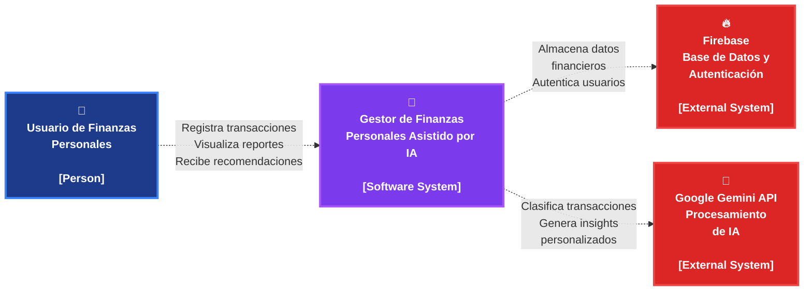
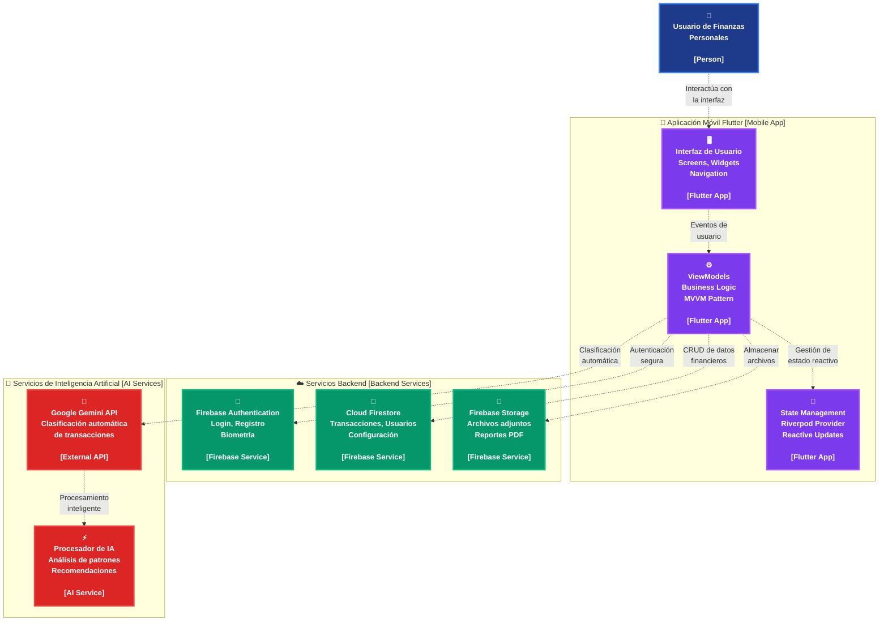

# Visualización de Diagramas - Aplicación de Finanzas Personales con IA

## Diagrama C1 - Contexto del Sistema

Este diagrama muestra la interacción entre el usuario y el sistema principal, así como las dependencias externas.

---

## Diagrama C2 - Contenedores

Este diagrama detalla la arquitectura interna del sistema, mostrando los principales contenedores y sus responsabilidades.

---

## Cómo Visualizar los Diagramas en VS Code

### Primero Instalar las extensiones
- Markdown Preview enhanced 
- Markdown Preview Mermaid

### Método 1: Vista Previa de Markdown (Recomendado)

1. Abre el archivo `visualizacion-diagramas.md` en VS Code
2. Presiona `Ctrl+Shift+V` para abrir la vista previa de Markdown
3. Los diagramas se renderizarán automáticamente

### Método 2: Vista Previa de Mermaid Directa
1. Abre cualquiera de los archivos `.mmd` en VS Code
2. Presiona `Ctrl+Shift+P` y busca "Mermaid Preview"
3. Selecciona "Mermaid: Preview" para ver el diagrama renderizado

### Método 3: Comando de Paleta
1. Con cualquier archivo `.mmd` abierto
2. `Ctrl+Shift+P` → "Mermaid: Preview"
3. Se abrirá una nueva pestaña con el diagrama renderizado

### Características de los Diagramas
- ✅ **Estilo profesional** con colores modernos
- ✅ **Iconos descriptivos** para mejor comprensión
- ✅ **Etiquetas de tipo** estándar [Person], [Software System], etc.
- ✅ **Líneas punteadas** para conexiones elegantes
- ✅ **Colores diferenciados** por tipo de componente
- ✅ **Estructura clara** y jerárquica
